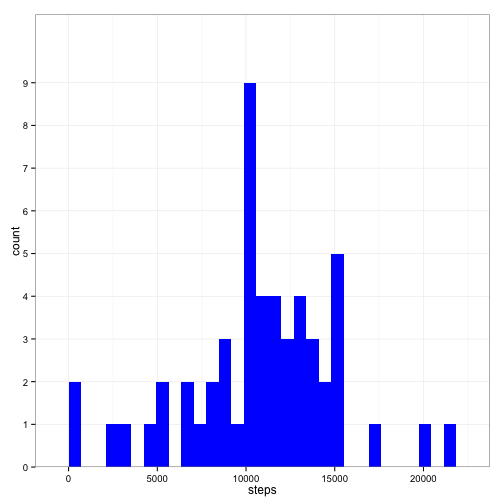
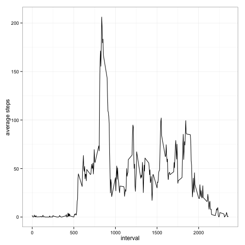
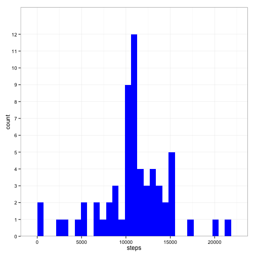
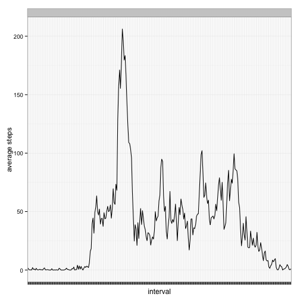

## Loading and preprocessing the data
First, load the necessary packages.

```r
require(plyr)
```

```
## Loading required package: plyr
```

```r
require(reshape2)
```

```
## Loading required package: reshape2
```

```r
require(ggplot2)
```

```
## Loading required package: ggplot2
```

Next, define some functions that we'll use manipulating data.

```r
IsDateWeekdayOrWeekend <- function(date) {
        retval <- ""
        dayofweek <- weekdays(as.Date(date, "%Y-%m-%d"))
        switch(dayofweek,
               月曜日={retval = "weekday"},
               火曜日={retval = "weekday"},
               水曜日={retval = "weekday"},
               木曜日={retval = "weekday"},
               金曜日={retval = "weekday"},
               土曜日={retval = "weekend"},
               日曜日={retval = "weekend"},
               {})
        return(retval)
}

GetStepSumsByDate <- function(activities) {
        return(ddply(activities,~date,summarise,
                     sum=sum(steps, na.rm=FALSE)))
}

GetStepMeansByInterval <- function(activities) {
        return(ddply(activities,~interval,summarise,
                     mean=mean(steps, na.rm=TRUE)))
}

GetStepMeansByIntervalAndWeekday <- function(activities) {
        return(ddply(activities,.(interval,weekdayorweekend),
                     summarise,mean=mean(steps, na.rm=TRUE)))
}
```

**1) Load the data (i.e. read.csv())**   

```r
activities <- read.csv(file = "activity.csv")
```

**2) Process/transform the data (if necessary) into a format suitable for your analysis**   

```r
naincl.datesums <- GetStepSumsByDate(activities)
naincl.intmeans <- GetStepMeansByInterval(activities)
```

## What is mean total number of steps taken per day?
**1) Make a histogram of the total number of steps taken each day**   

```r
ggplot(data = naincl.datesums, aes(x=sum)) + 
        geom_histogram(fill = "blue") + theme_bw() + xlab("steps") +
        scale_y_discrete()
```

```
## stat_bin: binwidth defaulted to range/30. Use 'binwidth = x' to adjust this.
```

 

**2) Calculate and report the mean and median total number of steps taken per day**   

```r
naincl.mean <- mean(naincl.datesums$sum, na.rm=TRUE)
naincl.median <- median(naincl.datesums$sum, na.rm=TRUE)
```
The mean is 1.076619 &times; 10<sup>4</sup>.   
The median is 1.0765 &times; 10<sup>4</sup>.   

## What is the average daily activity pattern?
**1) Make a time series plot of the 5-minute interval and the average number of steps taken, averaged across all days**    

```r
ggplot(data = naincl.intmeans, aes(interval, mean)) + geom_line() + 
        theme_bw() + ylab("average steps")
```

 

**2) Which 5-minute interval, on average across all the days in the dataset, contains the maximum number of steps?**   

```r
noincl.moststepsint <- 
        naincl.intmeans$interval[
                order(naincl.intmeans$mean,decreasing=TRUE)][1]
```
The 835 interval contains the max number of steps on average.

## Imputing missing values
**1) Calculate and report the total number of missing values in the dataset**   

```r
numna <- length(which(is.na(activities$steps)))
```
There are a total of 2304 missing values in the dataset.

**2) Devise a strategy for filling in all of the missing values in the dataset**   
Replace each of the missing values with the mean of that interval over all observed days.

**3) Create a new dataset that is equal to the original dataset but with the missing data filled in**   
Cast the data into a wide format, then replace the missing values in each column
with the mean of that column. Afterwards, melt that data into a narrow format.

```r
activities_wide <- dcast(activities, date ~ interval, value.var = "steps")
for(i in 2:ncol(activities_wide)) {
        activities_wide[is.na(activities_wide[,i]),i] <- 
                mean(na.omit(activities_wide[,i]))
}
nona.activities <- melt(activities_wide, id=c("date"))
names(nona.activities)[names(nona.activities)=="variable"] <- "interval"
names(nona.activities)[names(nona.activities)=="value"] <- "steps"
```

**4a) Make a histogram of the total number of steps taken each day.**   

```r
nona.datesums <- GetStepSumsByDate(nona.activities)
ggplot(data = nona.datesums, aes(x=sum)) + 
        geom_histogram(fill = "blue") + theme_bw() + xlab("steps") +
        scale_y_discrete()
```

```
## stat_bin: binwidth defaulted to range/30. Use 'binwidth = x' to adjust this.
```

 

**4b)  Calculate and report the mean and median total number of steps taken per day.**   

```r
nona.mean <- mean(nona.datesums$sum, na.rm=TRUE)
nona.median <- median(nona.datesums$sum, na.rm=TRUE)
```
The mean is 1.076619 &times; 10<sup>4</sup>.   
The median is 1.076619 &times; 10<sup>4</sup>. 

**Do these values differ from the estimates from the first part of the assignment? What is the impact of imputing missing data on the estimates of the total daily number of steps?**   
There are a large number of missing values in the dataset. Replacing them with 
the mean causes a number of values at the midpoint of the dataset to be equal 
to the mean. This has the effect of making the mean and median equal.

The mean is not affected.

## Are there differences in activity patterns between weekdays and weekends?
**1) Create a new factor variable in the dataset with two levels -- "weekday" and "weekend" indicating whether a given date is a weekday or weekend day.**   

```r
nona.activities$weekdayorweekend <- 
        sapply(nona.activities$date, IsDateWeekdayOrWeekend)
```

**2) Make a panel plot containing a time series plot of the 5-minute interval and the average number of steps taken, averaged across all weekday days or weekend days**   

```r
nona.intmeans <- GetStepMeansByIntervalAndWeekday(nona.activities)
ggplot(data = nona.intmeans, aes(interval, mean)) + 
        geom_line(aes(group=weekdayorweekend)) + 
        theme_bw() + 
        theme(axis.text.x = element_blank()) +
        ylab("average steps") + 
        facet_wrap(~weekdayorweekend, ncol=1)
```

 
